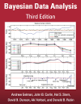

Bayesian Data Analysis Global South (GSU) 2021

Lecturer: [Aki Vehtari](https://users.aalto.fi/~ave/index.html)

1. Max 300 students with priority for global south and other underrepresented groups (GSU).
1. From 4th March (first assignment deadline 12th March) to 28th May .
1. All the material (textbook, videos, assignments, extra reading
   material) are freely available (see below) so you can also
   self-study in your own pace.
1. The course is free (no cost) and possible to organize with help of volunteer TAs.
1. This BDA course instance is aimed to support learning with peer
   support. By following the videos and doing assignments at the same
   time with others, you can discuss the material in assignments in
   the course slack, there is peer-grading platform to get feedback
   about your assignment solutions, and voluntary TAs help answering
   questions. As everything is volunteer based we can't guarantee
   quick responses, but at least you will get something more than when
   studying only by yourself.
1. This course is not the easiest Bayesian course available in
   internet, but it can be your first Bayesian course if your
   mathematical and programming skills are sufficient. See the
   prerequisites below. For easier material to start with see the end
   of Prerequisites section below.
1. You will not get a formal certificate for passing the course from
   Aalto University. 
1. The communication happens in the course slack, please don't email
   the lecturer or TAs. The slack link has been emailed to the accepted students.

All the course material is available in a [git repo](https://github.com/avehtari/BDA_course_Aalto) and via these pages are for easier navigation. All the material can be used in other courses. Text and videos licensed under CC-BY-NC 4.0. Code licensed under BSD-3.

## Registration

There has been some dropouts and the registration has been re-opened [here](https://forms.gle/Zax7A7yDrzV47tDd6).

## TA Registration

We have some volunteer TAs already, but a a few more would be great.
All TAs will get a personal certificate from the lecturer Aki Vehtari
if they actively participate helping students, answering questions,
and possibly organize some TA sessions. We assume to have enough TAs
that no-one needs to take part every week of the course and you can
drop out if other obligations require so. The lecturer will support
TAs.

To register as volunteer TA fill in your information (email, country,
prerequisites check, a brief comment on justification why you think
you can be a TA)  [here](https://forms.gle/Ey7NVQQ2qnBKfkK6A).

## Book: BDA3

 

[The electronic version of the course book
Bayesian Data Analysis, 3rd ed, by by Andrew Gelman, John Carlin, Hal
Stern, David Dunson, Aki Vehtari, and Donald Rubin](https://users.aalto.fi/~ave/BDA3.pdf) is available for non-commercial purposes. Hard copies are available from [the publisher](https://www.crcpress.com/Bayesian-Data-Analysis/Gelman-Carlin-Stern-Dunson-Vehtari-Rubin/p/book/9781439840955) and many book stores.
See also [home page for the
book](http://www.stat.columbia.edu/~gelman/book/), [errata for the
book](http://www.stat.columbia.edu/~gelman/book/errata_bda3.txt), and [chapter notes](chapter_notes/BDA_notes.pdf).

## Prerequisites

 - Basic terms of probability theory
     - probability, probability density, distribution
     - sum, product rule, and Bayes' rule
     - expectation, mean, variance, median
     - in English, see e.g. Wikipedia and [Introduction to probability and statistics](https://ocw.mit.edu/courses/mathematics/18-05-introduction-to-probability-and-statistics-spring-2014/readings/)
 - Some algebra and calculus
 - Basic visualisation techniques (R or Python)
     - histogram, density plot, scatter plot
     - see e.g. [BDA R demos](demos.html#BDA_R_demos)
     - see e.g. [BDA Python demos](demos.html#BDA_Python_demos)

This course has been designed so that there is strong emphasis in
computational aspects of Bayesian data analysis and using the latest
computational tools.

If you find BDA3 too difficult to start with, I recommend

 - For regression models, their connection to statistical testing and causal analysis see [Gelman, Hill and Vehtari, "Regression and Other Stories"](https://avehtari.github.io/ROS-Examples/).
 - Richard McElreath's [Statistical Rethinking, 2nd ed](https://xcelab.net/rm/statistical-rethinking/) book is easier than BDA3 and the 2nd ed is excellent. Statistical Rethinking doesn't go as deep in some details, math, algorithms and programming as BDA course. Richard's lecture videos of [Statistical Rethinking: A Bayesian Course Using R and Stan](https://github.com/rmcelreath/statrethinking_winter2019) are highly recommended even if you are following BDA3.
 - For background prerequisites some students have found chapters 2, 4 and 5 in [Kruschke, "Doing Bayesian Data Analysis"](https://sites.google.com/site/doingbayesiandataanalysis/) useful.

## Communication channels

- The primary communication channel is the course slack. The slack link has been emailed to the accepted students.
    - Don't ask via email or direct messages. By asking via common channels in the course chat, more eyes will see your question, it will get answered faster and it's likely that other students benefit from the answer.
    - In the chat system, there are separate channels for each assignment and the project.
    - Channel **#general** can be used for any kind of general discussions and questions related to the course.
    - All important announcements will be posted to **#announcements** (no discussion on this channel).
    - Any kind of feedback is welcome on channel **#feedback**.
    - We have also channels **#r**, **#python**, and **#stan** for questions that are not specific to assignments or the project.
    - The lecturer and teaching assistants have names with "(staff)" or "(TA)" in the end of their names.
- The lecturer will answer weekly the best questions about the material, either in text, recording additional video clips, or in live Q&A session (in this course instance no guarantee for weekly live session)
- In this course instance all the TAs are volunteers from different time zones, but there may be possibility for live "TA sessions" with TAs depending on the volunteers
- If you find errors in material, post in **#feedback** channel or [submit an issue in github](https://github.com/avehtari/BDA_course_Aalto/issues).
- Peergrade alerts: If you are worried that you forget the deadlines, you can set peergade to send you email when assignment opens for submission, 24 hours before assignment close for submission, assignment is open for reviewing, 24 hours before an assignment closes for reviewing if you haven't started yet, someone likes my feedback (once a day). Click your name -> User Settings to choose which alerts you want.

## Assessment

[Assignments](assignments_gsu.html) (67\%) and a [project work with
presentation](project_gsu.html) (33\%). Minimum of 50\% of points must
be obtained from both the assignments and project work. But as in this
course there is no formal certificate, the assignment scores are just
for your own self-evaluation. The biggest benefit from the course is
the support and feedback from other students and volunteer TAs.

We use [peergrade.io](https://peergrade.io/) for providing peer feedback for
the assignments and the project work. See more information at
[Assignments](assignments_gsu.html).

## Schedule 2021

The course consists of 12 blocks from March to May 2021. The blocks don't match exactly specific weeks. For example, it's good start reading the material for the next block while making the assignment for one block. There are 9 assignments and a project work with presentation, and thus the assignments are not in one-to-one correspondence with the blocks. The schedule below lists the blocks and how they connect to the topics, book chapters and assignments.

### Schedule overview

Here is an overview of the schedule. Scroll down the page to see detailed instructions for each block. Remember that blocks are overlapping so that when you are working on assignment for one block, you should start watching videos and reading text for the next block.

|   | Block                                          | Readings                                                                                                                                                                                                                                                                                              | Lectures                                                                                                                                                                                                                                                                                                                                                                                                                                                                                                                                                                                                               | Assignment                                                                                                |                                  | Assignment due date |
|---|:-----------------------------------------------|-------------------------------------------------------------------------------------------------------------------------------------------------------------------------------------------------------------------------------------------------------------------------------------------------------|------------------------------------------------------------------------------------------------------------------------------------------------------------------------------------------------------------------------------------------------------------------------------------------------------------------------------------------------------------------------------------------------------------------------------------------------------------------------------------------------------------------------------------------------------------------------------------------------------------------------|-----------------------------------------------------------------------------------------------------------|----------------------------------|---------------------|
|   | 1. Introduction                                | [BDA3 Chapter 1](chapter_notes/BDA_notes_ch1.pdf)                                                                                                                                                                                                                                                     | [Computational probabilistic modeling](https://www.youtube.com/watch?v=ukE5aqdoLZI),   [Introduction to uncertainty and modelling](https://aalto.cloud.panopto.eu/Panopto/Pages/Viewer.aspx?id=d841f429-9c3d-4d24-8228-a9f400efda7b),   [Introduction to the course contents](https://aalto.cloud.panopto.eu/Panopto/Pages/Viewer.aspx?id=13fc7889-cfd1-4d99-996c-a9f400f6e5a2)                                                                                                                                                                                                                                  | [Assignment 1](assignments/assignment1.pdf),   [Rubric questions](assignments/assignment1_rubric.html) |                                  | 14 March              |
|   | 2. Basics of Bayesian inference                | [BDA3 Chapter 1](chapter_notes/BDA_notes_ch1.pdf),   [BDA3 Chapter 2](chapter_notes/BDA_notes_ch2.pdf)                                                                                                                                                                                              | [Lecture 2.1](https://aalto.cloud.panopto.eu/Panopto/Pages/Viewer.aspx?id=9c271082-5a8c-4b66-b6c2-aacc00fc683f),   [Lecture 2.2](https://aalto.cloud.panopto.eu/Panopto/Pages/Viewer.aspx?id=70655a8a-0eb4-4ddd-9f52-aacc00fc67a2),   Optional:   [Extra explanations 2](https://aalto.cloud.panopto.eu/Panopto/Pages/Viewer.aspx?id=158d119d-8673-4120-8669-ac3900c13304),   [Summary 2.1](https://aalto.cloud.panopto.eu/Panopto/Pages/Viewer.aspx?id=7a297f7d-bb7b-4dd0-9913-a9f500ec822d),   [Summary 2.2](https://aalto.cloud.panopto.eu/Panopto/Pages/Viewer.aspx?id=75b9f18f-e379-4557-a5fa-a9f500f11b40),   [Summary 2.3](https://aalto.cloud.panopto.eu/Panopto/Pages/Viewer.aspx?id=099659a5-f707-473d-8b03-a9f500f39eb5) | [Assignment 2](assignments/assignment2.pdf),   [Rubric questions](assignments/assignment2_rubric.html) |                                  | 19.03.              |
|   | 3. Multidimensional posterior                  | [BDA3 Chapter 3](chapter_notes/BDA_notes_ch3.pdf)                                                                                                                                                                                                                                                     | [Lecture 3](https://aalto.cloud.panopto.eu/Panopto/Pages/Viewer.aspx?id=ab958b4b-e2c4-4534-8305-aad100ba191f)                                                                                                                                                                                                                                                                                                                                                                                                                                                                                                          | [Assignment 3](assignments/assignment3.pdf),   [Rubric questions](assignments/assignment3_rubric.html) |                                  | 26.03.              |
|   | 4. Monte Carlo                                 | [BDA3 Chapter 10](chapter_notes/BDA_notes_ch10.pdf)                                                                                                                                                                                                                                                   | [Lecture 4.1](https://aalto.cloud.panopto.eu/Panopto/Pages/Viewer.aspx?id=8a3c7bbc-e2b8-4c16-97b2-aad800ba7927),   [Lecture 4.2](https://aalto.cloud.panopto.eu/Panopto/Pages/Viewer.aspx?id=44446861-eaa2-41b5-bf33-aad800caf18a)                                                                                                                                                                                                                                                                                                                                                                                  | [Assignment 4](assignments/assignment4.pdf),   [Rubric questions](assignments/assignment4_rubric.html)  |                                  | 09.04.              |
|   | 5. Markov chain Monte Carlo                    | [BDA3 Chapter 11](chapter_notes/BDA_notes_ch11.pdf)                                                                                                                                                                                                                                                   | [Lecture 5.1](https://aalto.cloud.panopto.eu/Panopto/Pages/Viewer.aspx?id=098dfdb4-f3b8-46aa-b988-aadf00bd3177),   [Lecture 5.2](https://aalto.cloud.panopto.eu/Panopto/Pages/Viewer.aspx?id=9f657178-d8cf-4cb8-af62-aadf00cd9423)                                                                                                                                                                                                                                                                                                                                                                                  | [Assignment 5](assignments/assignment5.pdf),   [Rubric questions](assignments/assignment5_rubric.html)  |                                  | 16.04.              |
|   | 6. Stan, HMC, PPL                              | [BDA3 Chapter 12](chapter_notes/BDA_notes_ch12.pdf) + [extra material on Stan](index.html#stan)                                                                                                                                                                                                                 | [Lecture 6.1](https://aalto.cloud.panopto.eu/Panopto/Pages/Viewer.aspx?id=1744f6a0-84d3-4218-8a86-aae600ba7e84),  [Lecture 6.2](https://aalto.cloud.panopto.eu/Panopto/Pages/Viewer.aspx?id=e60ba1a9-f752-4b0a-88c6-aae600caa61a)                                                                                                                                                                                                                                                                                                                                                                                   | [Assignment 6](assignments/assignment6.pdf),   [Rubric questions](assignments/assignment6_rubric.html) |                                  | 23.04.              |
|   | 7. Hierarchical models and exchangeability     | [BDA3 Chapter 5](chapter_notes/BDA_notes_ch5.pdf)                                                                                                                                                                                                                                                     | [Lecture 7.1](https://aalto.cloud.panopto.eu/Panopto/Pages/Viewer.aspx?id=79dee6de-afa9-446f-b533-aaf400cabf2b),   [Lecture 7.2](https://aalto.cloud.panopto.eu/Panopto/Pages/Viewer.aspx?id=c822561c-f95d-44fc-a1d0-aaf400d9fae3)                                                                                                                                                                                                                                                                                                                                                                                  | [Assignment 7](assignments/assignment7.pdf),   [Rubric questions](assignments/assignment7_rubric.html) |                                  | 30.04.              |
|   | 8. Model checking & cross-validation           | [BDA3 Chapter 6](chapter_notes/BDA_notes_ch6.pdf), [BDA3 Chapter 7](chapter_notes/BDA_notes_ch7.pdf), [Visualization in Bayesian workflow](https://doi.org/10.1111/rssa.12378), [Practical Bayesian model evaluation using leave-one-out cross-validation and WAIC](https://arxiv.org/abs/1507.04544) | [Lecture 8.1](https://aalto.cloud.panopto.eu/Panopto/Pages/Viewer.aspx?id=7047e366-0df6-453c-867f-aafb00ca2d78),   [Lecture 8.2](https://aalto.cloud.panopto.eu/Panopto/Pages/Viewer.aspx?id=d7849131-0afd-4ae6-ad64-aafb00da36f4)                                                                                                                                                                                                                                                                                                                                                                                  | Start project work                                                                                        |                                  |                     |
|   | 9. Model comparison and selection              | [BDA3 Chapter 7 (not 7.2 and 7.3)](chapter_notes/BDA_notes_ch7.pdf),   [Practical Bayesian model evaluation using leave-one-out cross-validation and WAIC](https://arxiv.org/abs/1507.04544)                                                                                                       | [Lecture 9.1](https://aalto.cloud.panopto.eu/Panopto/Pages/Viewer.aspx?id=50b2e73f-af0a-4715-b627-ab0200ca7bbd),   Optional:   [Lecture 9.2](https://aalto.cloud.panopto.eu/Panopto/Pages/Viewer.aspx?id=b0299d53-9454-4e33-9086-ab0200db14ee),   [Lecture 9.3](https://aalto.cloud.panopto.eu/Panopto/Pages/Viewer.aspx?id=4b6eeb48-ae64-4860-a8c3-ab0200e40ad8)                                                                                                                                                                                                                                            | [Assignment 8](assignments/assignment8.pdf),   [Rubric questions](assignments/assignment8_rubric.html) |                                  | 07.05.              |
|   | 10. Decision analysis                          | [BDA3 Chapter 9](chapter_notes/BDA_notes_ch9.pdf)                                                                                                                                                                                                                                                     | [Lecture 10.1](https://aalto.cloud.panopto.eu/Panopto/Pages/Viewer.aspx?id=82943720-de0f-4195-8639-ab0900ca2085)                                                                                                                                                                                                                                                                                                                                                                                                                                                                                                       | [Assignment 9](assignments/assignment9.pdf),   [Rubric questions](assignments/assignment9_rubric.html) |                                  | 14.05.              |
|   | 11. Normal approximation, frequency properties | [BDA3 Chapter 4](chapter_notes/BDA_notes_ch4.pdf)                                                                                                                                                                                                                                                     | [Lecture 11.1](https://aalto.cloud.panopto.eu/Panopto/Pages/Viewer.aspx?id=e22fedc7-9fd3-4d1e-8318-ab1000ca45a4),   [Lecture 11.2](https://aalto.cloud.panopto.eu/Panopto/Pages/Viewer.aspx?id=a8e38a95-a944-4f3d-bf95-ab1000dbdf73)                                                                                                                                                                                                                                                                                                                                                                                |                                                                                                           |                                  |                     |
|   | 12. Extended topics                            | Optional: BDA3 Chapter 8,   BDA3 Chapter 14-18,   BDA3 Chapter 21                                                                                                                                                                                                                               | Optional:   [Lecture 12.1](https://aalto.cloud.panopto.eu/Panopto/Pages/Viewer.aspx?id=e998b5dd-bf8e-42da-9f7c-ab1700ca2702),   [Lecture 12.2](https://aalto.cloud.panopto.eu/Panopto/Pages/Viewer.aspx?id=c43c862a-a5a4-45da-9b27-ab1700e12012)                                                                                                                                                                                                                                                                                                                                                                 | Project work                                                                                              |                                  | 21.05.                |
|   | 13. Project feedback                           |                                                                                                                                                                                                                                                                                                       |                                                                                                                                                                                                                                                                                                                                                                                                                                                                                                                                                                                                                        | Project feedback                                                                                          |                                  |  28.05.             |

### 1) Course introduction, BDA 3 Ch 1, prerequisites assignment

Course practicalities, material, assignments, project work, peergrading, TA sessions, prerequisites, chat, etc.

- Login to the course chat (link will be emailed to the registered students and volunteer TAs)
- Signin to [Peergrade](https://www.peergrade.io) with the class code shared in email
- Watch videos
    - [Computational probabilistic modeling](https://www.youtube.com/watch?v=ukE5aqdoLZI) (15min)
    - [Introduction to uncertainty and modelling](https://aalto.cloud.panopto.eu/Panopto/Pages/Viewer.aspx?id=d841f429-9c3d-4d24-8228-a9f400efda7b) (18min)
    - [Introduction to the course contents](https://aalto.cloud.panopto.eu/Panopto/Pages/Viewer.aspx?id=13fc7889-cfd1-4d99-996c-a9f400f6e5a2) (8min)
    - [Slides](https://github.com/avehtari/BDA_course_Aalto/tree/master/slides)
/- Read BDA3 Chapter 1
    - start with [reading instructions for Chapter 1](chapter_notes/BDA_notes_ch1.pdf) and afterwards read the additional comments in the same document
- There are no R/Python demos for Chapter 1
- Make and submit [Assignment 1](assignments/assignment1.pdf). **Deadline Friday 14 March 23:59 UTC+2**
    - this assignment checks that you have sufficient prerequisite skills (basic probability calculus, and R or Python)
        - [Rubric questions used in peergrading for Assignment 1](assignments/assignment1_rubric.html)
    - [General information about assignments](assignments_gsu.html)
        - [R markdown template for assignments](https://github.com/avehtari/BDA_course_Aalto/tree/master/templates/)
        - [FAQ for the assignments](FAQ.html) has solutions to commonly asked questions related RStudio setup, errors during package installations, etc.
- Optional: Make BDA3 exercises 1.1-1.4, 1.6-1.8 ([model solutions available for 1.1-1.6](http://www.stat.columbia.edu/~gelman/book/solutions3.pdf))
- Start reading Chapters 1+2, see instructions below

### 2) BDA3 Ch 1+2, basics of Bayesian inference

BDA3 Chapters 1+2, basics of Bayesian inference, observation model, likelihood, posterior and binomial model, predictive distribution and benefit of integration, priors and prior information, and one parameter normal model.

- Read BDA3 Chapter 2
    - see [reading instructions for Chapter 2](chapter_notes/BDA_notes_ch2.pdf)
- Watch videos [Lecture 2.1](https://aalto.cloud.panopto.eu/Panopto/Pages/Viewer.aspx?id=9c271082-5a8c-4b66-b6c2-aacc00fc683f) and [Lecture 2.2](https://aalto.cloud.panopto.eu/Panopto/Pages/Viewer.aspx?id=70655a8a-0eb4-4ddd-9f52-aacc00fc67a2) on basics of Bayesian inference, observation model, likelihood, posterior and binomial model, predictive distribution and benefit of integration, priors and prior information, and one parameter normal model. BDA3 Ch 1+2.
    - [Extra explanations about likelihood, normalization term, density, and conditioning on model M](https://aalto.cloud.panopto.eu/Panopto/Pages/Viewer.aspx?id=158d119d-8673-4120-8669-ac3900c13304)
    - [Slides](https://github.com/avehtari/BDA_course_Aalto/tree/master/slides)
- Optional summary videos:
    - [2.1 Observation model, likelihood, posterior and binomial model](https://aalto.cloud.panopto.eu/Panopto/Pages/Viewer.aspx?id=7a297f7d-bb7b-4dd0-9913-a9f500ec822d)
    - [2.2 Predictive distribution and benefit of integration](https://aalto.cloud.panopto.eu/Panopto/Pages/Viewer.aspx?id=75b9f18f-e379-4557-a5fa-a9f500f11b40)
    - [2.3 Priors and prior information](https://aalto.cloud.panopto.eu/Panopto/Pages/Viewer.aspx?id=099659a5-f707-473d-8b03-a9f500f39eb5)
- Read [the additional comments for Chapter 2](chapter_notes/BDA_notes_ch2.pdf)
- Check [R demos](demos.html#BDA_R_demos) or [Python demos](demos.html#BDA_Python_demos) for Chapter 2
- Make and submit [Assignment 2](assignments/assignment2.pdf). **Deadline Friday 19 March 23:59 UTC+2**
    - [Rubric questions used in peergrading for Assignment 2](assignments/assignment2_rubric.html)
    - Review Assignment 1 done by your peers before 23:59 UTC+2 17 March
    - Reflect on your feedback
- Optional: Make BDA3 exercises 2.1-2.5, 2.8, 2.9, 2.14, 2.17, 2.22 ([model solutions available for 2.1-2.5, 2.7-2.13, 2.16, 2.17, 2.20](http://www.stat.columbia.edu/~gelman/book/solutions3.pdf), and 2.14 is in course slides)
- Start reading Chapter 3, see instructions below

### 3) BDA3 Ch 3, multidimensional posterior

Multiparameter models, joint, marginal and conditional distribution, normal model, bioassay example, grid sampling and grid evaluation. BDA3 Ch 3.

- Read BDA3 Chapter 3
    - see [reading instructions for Chapter 3](chapter_notes/BDA_notes_ch3.pdf)
- Watch [Lecture 3](https://aalto.cloud.panopto.eu/Panopto/Pages/Viewer.aspx?id=ab958b4b-e2c4-4534-8305-aad100ba191f) on multiparameter models, joint, marginal and conditional distribution, normal model, bioassay example, grid sampling and grid evaluation. BDA3 Ch 3.
    - [Slides](https://github.com/avehtari/BDA_course_Aalto/tree/master/slides)
- Read [the additional comments for Chapter 3](chapter_notes/BDA_notes_ch3.pdf)
- Check [R demos](demos.html#BDA_R_demos) or [Python demos](demos.html#BDA_Python_demos) for Chapter 3
- Make and submit [Assignment 3](assignments/assignment3.pdf). **Deadline Friday 26 March 23:59 UTC+2**
    - [Rubric questions used in peergrading for Assignment 3](assignments/assignment3_rubric.html)
    - Review Assignment 2 done by your peers  before 23:59 UTC+2 24 March, and reflect on your feedback
- Optional: Make BDA3 exercises 3.2, 3.3, 3.9 ([model solutions available for 3.1-3.3, 3.5, 3.9, 3.10](http://www.stat.columbia.edu/~gelman/book/solutions3.pdf))
- Start reading Chapter 10, see instructions below

### 4) BDA3 Ch 10, Monte Carlo

Numerical issues, Monte Carlo, how many simulation draws are needed, how many digits to report, direct simulation, curse of dimensionality, rejection sampling, and importance sampling. BDA3 Ch 10.

- Read BDA3 Chapter 10
    - see [reading instructions for Chapter 10](chapter_notes/BDA_notes_ch10.pdf)
- Watch [Lecture 4.1](https://aalto.cloud.panopto.eu/Panopto/Pages/Viewer.aspx?id=8a3c7bbc-e2b8-4c16-97b2-aad800ba7927) on numerical issues, Monte Carlo, how many simulation draws are needed, how many digits to report, and [Lecture 4.2](https://aalto.cloud.panopto.eu/Panopto/Pages/Viewer.aspx?id=44446861-eaa2-41b5-bf33-aad800caf18a) on direct simulation, curse of dimensionality, rejection sampling, and importance sampling. BDA3 Ch 10.
    - [Slides](https://github.com/avehtari/BDA_course_Aalto/tree/master/slides)
- Read [the additional comments for Chapter 10](chapter_notes/BDA_notes_ch10.pdf)
- Check [R demos](demos.html#BDA_R_demos) or [Python demos](demos.html#BDA_Python_demos) for Chapter 10
- Make and submit [Assignment 4](assignments/assignment4.pdf). **Deadline Friday 9 April 23:59 UTC+3**
    - [Rubric questions used in peergrading for Assignment 4](assignments/assignment4_rubric.html)
    - Review Assignment 3 done by your peers before 23:59 UTC+3 7 April, and reflect on your feedback
- Optional: Make BDA3 exercises 10.1, 10.2 ([model solution available for 10.4](http://www.stat.columbia.edu/~gelman/book/solutions3.pdf))
- Start reading Chapter 11, see instructions below

### 5) BDA3 Ch 11, Markov chain Monte Carlo

Markov chain Monte Carlo, Gibbs sampling, Metropolis algorithm, warm-up, convergence diagnostics, R-hat, and effective sample size. BDA3 Ch 11.

- Read BDA3 Chapter 11
    - see [reading instructions for Chapter 11](chapter_notes/BDA_notes_ch11.pdf)
- Watch [Lecture 5.1](https://aalto.cloud.panopto.eu/Panopto/Pages/Viewer.aspx?id=098dfdb4-f3b8-46aa-b988-aadf00bd3177) on Markov chain Monte Carlo, Gibbs sampling, Metropolis algorithm, and [Lecture 5.2](https://aalto.cloud.panopto.eu/Panopto/Pages/Viewer.aspx?id=9f657178-d8cf-4cb8-af62-aadf00cd9423) on warm-up, convergence diagnostics, R-hat, and effective sample size. BDA3 Ch 11.
    - [Slides](https://github.com/avehtari/BDA_course_Aalto/tree/master/slides)
- Read [the additional comments for Chapter 11](chapter_notes/BDA_notes_ch11.pdf)
- Check [R demos](demos.html#BDA_R_demos) or [Python demos](demos.html#BDA_Python_demos) for Chapter 11
- Make and submit [Assignment 5](assignments/assignment5.pdf). **Deadline Friday 16 April 23:59 UTC+3**
    - [Rubric questions used in peergrading for Assignment 5](assignments/assignment5_rubric.html)
    - Review Assignment 4 done by your peers before 23:59 UTC+3 14 April, and reflect on your feedback
- Optional: Make BDA3 exercise 11.1 ([model solution available for 11.1](http://www.stat.columbia.edu/~gelman/book/solutions3.pdf))
- Start reading Chapter 12 + Stan material, see instructions below

### 6) BDA3 Ch 12 + Stan, HMC, PPL, Stan

HMC, NUTS, dynamic HMC and HMC specific convergence diagnostics, probabilistic programming and Stan. BDA3 Ch 12 + [extra material](index.html#stan)

- Read BDA3 Chapter 12
    - see [reading instructions for Chapter 12](chapter_notes/BDA_notes_ch12.pdf)
- Watch [Lecture 6.1](https://aalto.cloud.panopto.eu/Panopto/Pages/Viewer.aspx?id=1744f6a0-84d3-4218-8a86-aae600ba7e84) on HMC, NUTS, dynamic HMC and HMC specific convergence diagnostics, and [Lecture 6.2](https://aalto.cloud.panopto.eu/Panopto/Pages/Viewer.aspx?id=e60ba1a9-f752-4b0a-88c6-aae600caa61a) on probabilistic programming and Stan. BDA3 Ch 12 + [extra material](#stan).
    - [Slides](https://github.com/avehtari/BDA_course_Aalto/tree/master/slides)
    - Optional: [Stan Extra introduction recorded 2020](https://aalto.cloud.panopto.eu/Panopto/Pages/Viewer.aspx?id=f4b61f2a-4a94-43f7-828c-ac460144f64f) Golf putting example, main features of Stan, benefits of probabilistic programming, and comparison to some other software.
- Read [the additional comments for Chapter 12](chapter_notes/BDA_notes_ch12.pdf)
- Read [Stan introduction article](http://www.stat.columbia.edu/~gelman/research/published/Stan-paper-aug-2015.pdf)
- Check [R demos](demos.html#BDA_R_demos) for RStan or [Python demos](demos.html#BDA_Python_demos) for PyStan
- Additional material for Stan:
    - [Documentation](http://mc-stan.org/documentation/)
    - [RStan installation](https://github.com/stan-dev/rstan/wiki/RStan-Getting-Started)
    - [PyStan installation](https://pystan.readthedocs.io/en/latest/getting_started.html)
    - Basics of Bayesian inference and Stan, Jonah Gabry & Lauren Kennedy [Part 1](https://www.youtube.com/watch?v=ZRpo41l02KQ&t=8s&list=PLuwyh42iHquU4hUBQs20hkBsKSMrp6H0J&index=6) and [Part 2](https://www.youtube.com/watch?v=6cc4N1vT8pk&t=0s&list=PLuwyh42iHquU4hUBQs20hkBsKSMrp6H0J&index=7)
- Make and submit [Assignment 6](assignments/assignment6.pdf). **Deadline Friday 23 April 23:59 UTC+3**
    - [Rubric questions used in peergrading for Assignment 6](assignments/assignment6_rubric.html)
    - Review Assignment 5 done by your peers before 23:59 UTC+3 21 April, and reflect on your feedback
- Start reading Chapter 5 + Stan material, see instructions below

### 7) BDA3 Ch 5, hierarchical models

Hierarchical models and exchangeability. BDA3 Ch 5.

- Read BDA3 Chapter 5
    - see [reading instructions for Chapter 5](chapter_notes/BDA_notes_ch5.pdf)
- Watch [Lecture 7.1](https://aalto.cloud.panopto.eu/Panopto/Pages/Viewer.aspx?id=79dee6de-afa9-446f-b533-aaf400cabf2b) on hierarchical models, and [Lecture 7.2](https://aalto.cloud.panopto.eu/Panopto/Pages/Viewer.aspx?id=c822561c-f95d-44fc-a1d0-aaf400d9fae3) on exchangeability. BDA3 Ch 5.
    - [Slides](https://github.com/avehtari/BDA_course_Aalto/tree/master/slides)
- Read [the additional comments for Chapter 5](chapter_notes/BDA_notes_ch5.pdf)
- Check [R demos](demos.html#BDA_R_demos) or [Python demos](demos.html#BDA_Python_demos) for Chapter 5
- Make and submit [Assignment 7](assignments/assignment7.pdf). **Deadline Friday 30 April 23:59 UTC+3**
    - [Rubric questions used in peergrading for Assignment 7](assignments/assignment7_rubric.html)
    - Review Assignment 6 done by your peers before 23:59 UTC+3 28 April, and reflect on your feedback
- Optional: Make BDA3 exercises 5.1 and 5.1 ([model solution available for 5.3-5.5, 5.7-5.12](http://www.stat.columbia.edu/~gelman/book/solutions3.pdf))
- Start reading Chapters 6-7 and additional material, see instructions below.

### 8) BDA3 Ch 6+7 + extra material, model checking, cross-validation

Model checking and cross-validation.

- Read BDA3 Chapters 6 and 7 (skip 7.2 and 7.3)
    - see [reading instructions for Chapter 6](chapter_notes/BDA_notes_ch6.pdf) and
      [Chapter 7](chapter_notes/BDA_notes_ch7.pdf)
- Read [Visualization in Bayesian workflow](https://doi.org/10.1111/rssa.12378)
    - more about workflow and examples of prior predictive checking and LOO-CV probability integral transformations
- Read [Practical Bayesian model evaluation using leave-one-out cross-validation and WAIC](https://arxiv.org/abs/1507.04544) ([Journal link](https://doi.org/10.1007/s11222-016-9696-4))
    - replaces BDA3 Sections 7.2 and 7.3 on cross-validation
- Watch [Lecture 8.1](https://aalto.cloud.panopto.eu/Panopto/Pages/Viewer.aspx?id=7047e366-0df6-453c-867f-aafb00ca2d78) on model checking, and [Lecture 8.2](https://aalto.cloud.panopto.eu/Panopto/Pages/Viewer.aspx?id=d7849131-0afd-4ae6-ad64-aafb00da36f4) on cross-validation part 1. BDA3 Ch 6-7 + extra material.
    - [Slides](https://github.com/avehtari/BDA_course_Aalto/tree/master/slides)
- Read [the additional comments for Chapter 6](chapter_notes/BDA_notes_ch6.pdf) and [Chapter 7](chapter_notes/BDA_notes_ch7.pdf)
- Check [R demos](demos.html#BDA_R_demos) or [Python demos](demos.html#BDA_Python_demos) for Chapter 6
- Additional reading material
    - [Model selection](https://avehtari.github.io/modelselection/)
    - [Cross-validation FAQ](https://avehtari.github.io/modelselection/CV-FAQ.html)
- No new assignment in this block
- Start [the project work](project.Rmd)
- Optional: Make BDA3 exercise 6.1 ([model solution available for 5.3-5.5, 5.7-5.12](http://www.stat.columbia.edu/~gelman/book/solutions3.pdf))

### 9) BDA3 Ch 7, extra material, model comparison and selection

PSIS-LOO, K-fold-CV, model comparison and selection. Extra lecture on variable selection with projection predictive variable selection.

- Read Chapter 7 (no 7.2 and 7.3)
    - see [reading instructions for Chapter 7](chapter_notes/BDA_notes_ch7.pdf)
- Read [Practical Bayesian model evaluation using leave-one-out cross-validation and WAIC](https://arxiv.org/abs/1507.04544) ([Journal link](https://doi.org/10.1007/s11222-016-9696-4))
    - replaces BDA3 Sections 7.2 and 7.3 on cross-validation
- Watch [Lecture 9.1](https://aalto.cloud.panopto.eu/Panopto/Pages/Viewer.aspx?id=50b2e73f-af0a-4715-b627-ab0200ca7bbd) PSIS-LOO and K-fold-CV.
- Optional: [Lecture 9.2](https://aalto.cloud.panopto.eu/Panopto/Pages/Viewer.aspx?id=b0299d53-9454-4e33-9086-ab0200db14ee) model comparison and selection, and [Lecture 9.3](https://aalto.cloud.panopto.eu/Panopto/Pages/Viewer.aspx?id=4b6eeb48-ae64-4860-a8c3-ab0200e40ad8) extra lecture on variable selection with projection predictive variable selection. Extra material.
    - [Slides](https://github.com/avehtari/BDA_course_Aalto/tree/master/slides)
- Additional reading material
    - [Model selection](https://avehtari.github.io/modelselection/)
    - [Cross-validation FAQ](https://avehtari.github.io/modelselection/CV-FAQ.html)
- Make and submit [Assignment 8](assignments/assignment8.pdf). **Deadline Friday 7 May 23:59 UTC+3**
    - [Rubric questions used in peergrading for Assignment 8](assignments/assignment8_rubric.html)
    - Review Assignment 7 done by your peers before 23:59 UTC+3 5 May, and reflect on your feedback
- Start reading Chapter 9, see instructions below.

### 10) BDA3 Ch 9, decision analysis

Decision analysis. BDA3 Ch 9.

- Read Chapter 9
    - see [reading instructions for Chapter 9](chapter_notes/BDA_notes_ch9.pdf)
- Watch [Lecture 10.1](https://aalto.cloud.panopto.eu/Panopto/Pages/Viewer.aspx?id=82943720-de0f-4195-8639-ab0900ca2085) on decision analysis. BDA3 Ch 9.
    - [Slides](https://github.com/avehtari/BDA_course_Aalto/tree/master/slides)
- Project presentation info will be updated soon.
- Make and submit [Assignment 9](assignments/assignment9.pdf). **Deadline Friday 14 May 23:59 UTC+3**
    - [Rubric questions used in peergrading for Assignment 9](assignments/assignment9_rubric.html)
    - Review Assignment 8 done by your peers before 23:59 UTC+3 12 May, and reflect on your feedback
- Start reading Chapter 4, see instructions below.

### 11) BDA3 Ch 4 + extra material, normal approximation, frequency properties

Normal approximation (Laplace approximation), and large sample theory and counter examples. BDA3 Ch 4.

- Read Chapter 4
    - see [reading instructions for Chapter 4](chapter_notes/BDA_notes_ch4.pdf)
- Watch [Lecture 11.1](https://aalto.cloud.panopto.eu/Panopto/Pages/Viewer.aspx?id=e22fedc7-9fd3-4d1e-8318-ab1000ca45a4) on normal approximation (Laplace approximation) and [Lecture 11.2](https://aalto.cloud.panopto.eu/Panopto/Pages/Viewer.aspx?id=a8e38a95-a944-4f3d-bf95-ab1000dbdf73) on large sample theory and counter examples. BDA3 Ch 4.
    - [Slides](https://github.com/avehtari/BDA_course_Aalto/tree/master/slides)
- No new assignment. Work on project. 
    - Review Assignment 9 done by your peers before 23:59 UTC+3 19 May, and reflect on your feedback

### 12) extra material + overview of BDA3 Ch 8, 14-18, 21

Frequency evaluation of Bayesian methods, hypothesis testing and variable selection. Overview of modeling data collection, BDA3 Ch 8, linear models, BDA Ch 14-18, lasso, horseshoe and Gaussian processes, BDA3 Ch 21.

- These lectures are optional, but especially the lecture on hypothesis testing and variable selection is useful for project work.
- Watch [Lecture 12.1](https://aalto.cloud.panopto.eu/Panopto/Pages/Viewer.aspx?id=e998b5dd-bf8e-42da-9f7c-ab1700ca2702) on frequency evaluation, hypothesis testing and variable selection and [Lecture 12.2](https://aalto.cloud.panopto.eu/Panopto/Pages/Viewer.aspx?id=c43c862a-a5a4-45da-9b27-ab1700e12012) overview of modeling data collection, BDA3 Ch 8, linear models, BDA Ch 14-18, lasso, horseshoe and Gaussian processes, BDA3 Ch 21.
    - [Slides](https://github.com/avehtari/BDA_course_Aalto/tree/master/slides)
- Work on project. TAs help with projects. **Project deadline 21 May 23:59 UTC+3**

### 13) Project evaluation

- Project report deadline 21 May 23:59 UTC+3 (submit to peergrade).
    - Review project reports done by your peers before 26 May 23:59 UTC+3, and reflect on your feedback

## R and Python

We strongly recommend using R in the course as there are more packages for Stan and statistical analysis in R. If you are already fluent in Python, but not in R, then using Python may be easier, but it can still be more useful to learn also R. Unless you are already experienced and have figured out your preferred way to work with R, we recommend

- installing [RStudio Desktop](https://www.rstudio.com/products/rstudio/download/),

See [FAQ](FAQ.html) for frequently asked questions about R problems in this course. The [demo codes](demos.html) provide useful starting points for all the assignments.

- For learning R programming basics
    - [Garrett Grolemund, Hands-On Programming with R](https://rstudio-education.github.io/hopr/)
- For learning basic and advanced plotting using R
    - [Kieran Healy, Data Visualization - A practical introduction](https://socviz.co/)
    - [Antony Unwin, Graphical Data Analysis with R](http://www.gradaanwr.net/)

